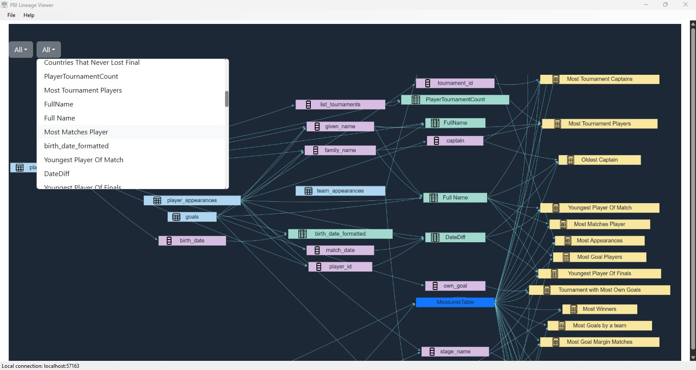
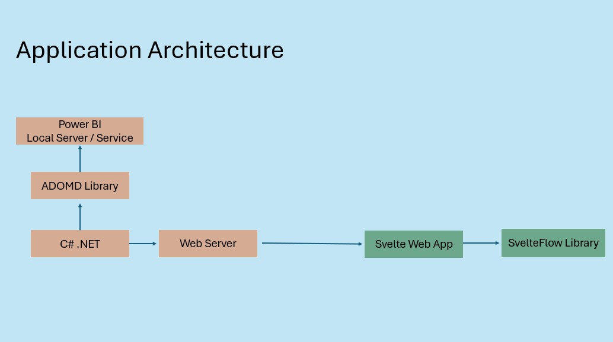

# PBI Lineage Viewer

PBI Lineage Viewer is a lineage graphing tool that makes it easy to understand the lineage in terms of tables and measures. The application is still Work In Progress.

Prerequisite:
.NET 8 or Above

## Usage
I am working on an installer for this.

## Architecture
The application is using C# and Javascript libraries for showing the lineage graph. C# is used to get the metadata from Power BI Local server/Service
and to run a webserver. This webserver is used to host the web application that shows the lineage graph. The web application is built using Svelte and uses
Cytoscape library. 

## Contributing

Pull requests are welcome. For major changes, please open an issue first
to discuss what you would like to change.

Please make sure to update tests as appropriate.

## License

[MIT](https://choosealicense.com/licenses/mit/)
